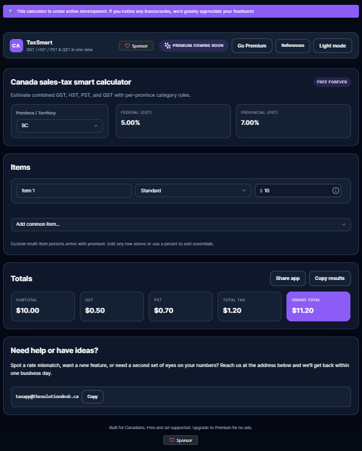

<div align="center">

# TaxSmart — Canadian Sales-Tax Calculator

**GST • HST • PST • QST — fast, accurate totals with shareable scenarios**

[](https://taxapp.thesolutiondesk.ca/)


</div>

<p align="center">
  
</p>

---

## Overview

**TaxSmart** is a privacy-first calculator for Canadian sales taxes across provinces and territories.
It’s built for shoppers, freelancers, and small businesses who need clear line-item math and **shareable scenarios**—without accounts or tracking.

* **Province/territory-aware rates:** GST / HST / PST / QST
* **Line items:** price × quantity with automatic tax breakdown
* **Clear totals:** `subtotal → taxes → total`
* **Shareable:** copy the page URL to share a scenario
* **Responsive & keyboard-friendly** (works great on mobile and desktop)
* **No sign-in required** for the core calculator

> **Live app:** [https://taxapp.thesolutiondesk.ca/](https://taxapp.thesolutiondesk.ca/)

---

## Quick Start

**Requirements:** Node 20+ and npm.

```bash
# 1) Install
npm ci

# 2) Run locally (Vite dev server)
npm run dev

# 3) Production build
npm run build

# 4) Preview the production build
npm run preview
```

> The dev server prints a localhost URL. Open it to use TaxSmart during development.

---

## How to Use

1. Select your **province/territory**.
2. Add **items** (unit price & quantity).
3. Review the **tax breakdown and total**.
4. **Copy the URL** to share the scenario (bookmark frequent scenarios).

---

## Tech Stack

* **Vite** + **React** + **TypeScript**
* Lightweight state + utility libs
* Simple, accessible UI with sensible defaults

---

## Project Structure

```
tax-smart-canadian-calculator/
├─ public/           # static assets
├─ assets/           # repo images (README/social)
├─ src/
│  ├─ components/    # UI components
│  ├─ lib/           # tax helpers & utilities
│  ├─ styles/        # global styles (if applicable)
│  ├─ App.tsx        # root app
│  └─ main.tsx       # Vite entry
├─ index.html
├─ package.json
└─ vite.config.ts
```

---

## Accessibility

We aim for **WCAG-sensible defaults**:

* Labeled controls, descriptive `alt` text, visible focus states
* Full keyboard navigation for interactive elements
* Contrast targets near **AA** where feasible

If you hit an accessibility snag, please open an issue with your **browser/OS/assistive-tech** details.

---

## Privacy & Accuracy

* **Privacy:** the core calculator doesn’t require accounts or collect personal data.
* **Accuracy:** rates are maintained with best efforts, but tax outcomes vary by context.
* **Disclaimer:** This tool is informational only and **not** tax or financial advice.
  For authoritative guidance, verify with the **CRA** and your province/territory tax authority.

---

## Troubleshooting

* **Blank page after deploy**
  Ensure built files are served from the correct base path
  (Vite’s `base` option must match your hosting subpath, if any).

* **Styles not applying**
  Confirm CSS is present in `dist/` and referenced by `index.html`.

* **Module not found**
  Run `npm ci` to install a clean dependency set.

---

## Roadmap

* CSV import/export
* Saved scenarios (local-first)
* Small-business presets
* In-app links to official rate sources
* Print-friendly layout

Have an idea? Open an **Issue** or start a **Discussion**.

---

## Contributing

Contributions are welcome!

1. Fork the repo & create a feature branch.
2. Make focused changes with clear commit messages.
3. If you change **tax logic or rates**, update `CHANGELOG.md` and link sources.
4. Open a PR describing what changed and why (screenshots welcome).

Please review:

* [`CODE_OF_CONDUCT.md`](./CODE_OF_CONDUCT.md)
* [`CONTRIBUTING.md`](./CONTRIBUTING.md)
* [`SECURITY.md`](./SECURITY.md)
* [`SUPPORT.md`](./SUPPORT.md)

---

## License

MIT © The Solution Desk
